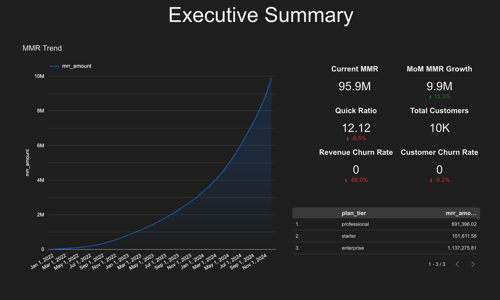
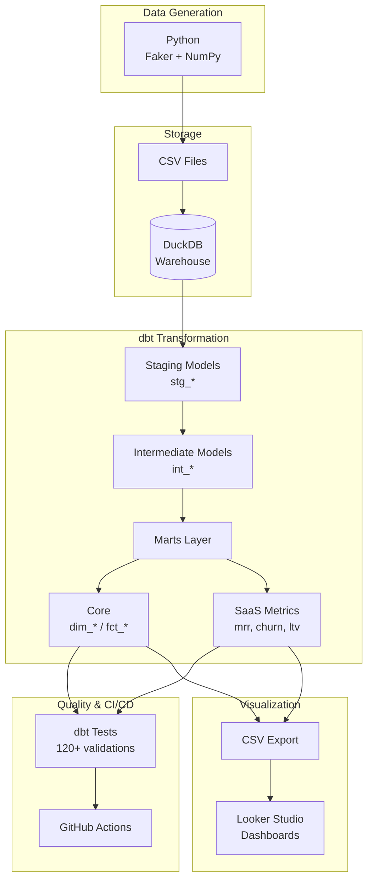
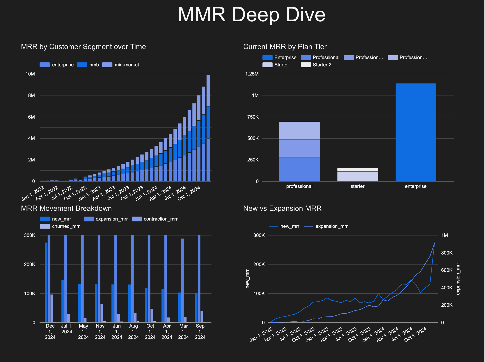
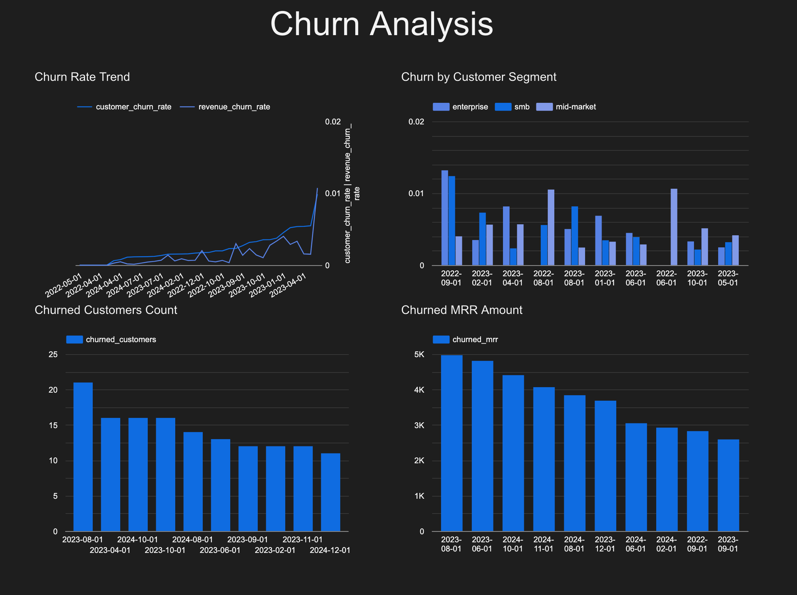
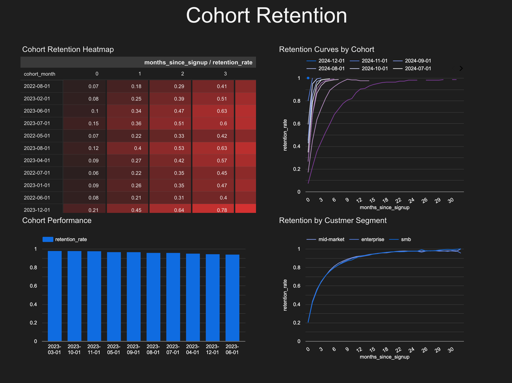
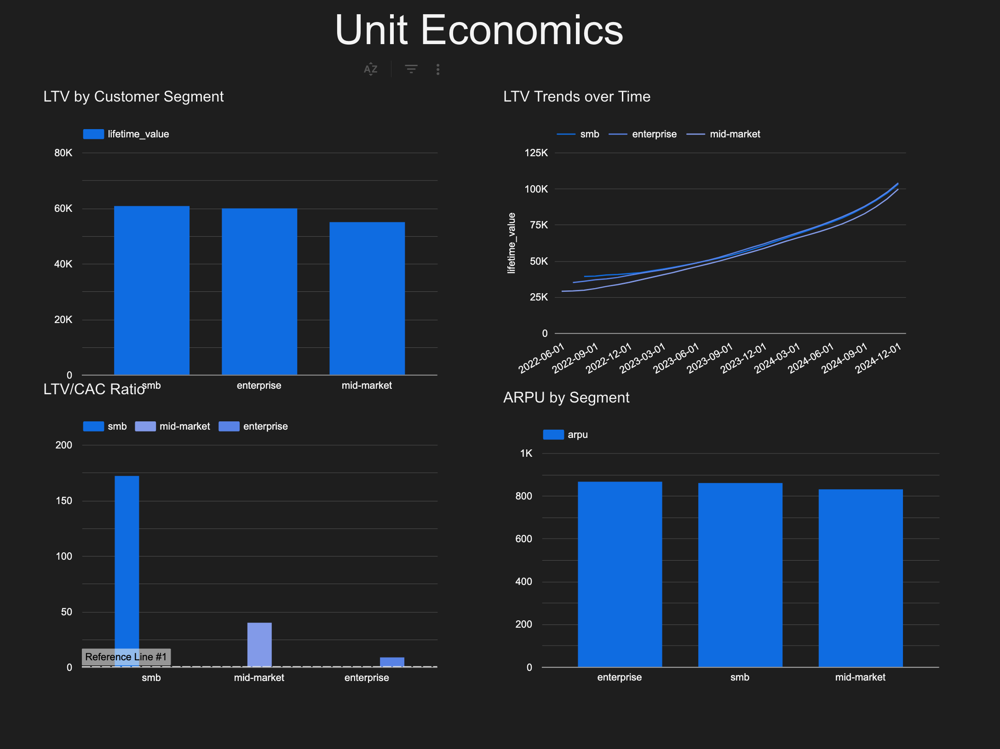

# SaaS Analytics & Data Quality Engineering Project

[](https://github.com/ftacc41/saas-analytics-quality/actions/workflows/dbt_tests.yml)

A production-grade analytics platform for subscription-based SaaS businesses that demonstrates advanced analytics engineering skills, focusing on **depth over breadth** - showcasing mastery of data modeling, data quality, and business metrics.



## 🎯 Project Overview

This project builds a complete analytics layer for a SaaS subscription business, emphasizing:
- **Data Quality**: Comprehensive testing and validation
- **Business Metrics**: Investor-grade SaaS metrics (MRR, churn, LTV, NRR)
- **Production Practices**: CI/CD, documentation, monitoring
- **Technical Depth**: Advanced dbt features, custom macros, semantic layer

## 📊 Business Context

Analyzing subscription business data to deliver reliable SaaS metrics and ensure data quality through comprehensive testing. This project simulates the analytics foundation that would support a growing SaaS company's decision-making.

**Key Business Questions:**
- How is our recurring revenue trending?
- What's our customer churn rate and why are customers leaving?
- What's the lifetime value of our customers?
- Which customer cohorts have the best retention?
- Are we growing efficiently? (Unit economics)
- How healthy is our revenue (expansion vs contraction)?

## 🏗️ Technical Architecture



### Tech Stack
| Component | Technology | Purpose |
|-----------|------------|---------|
| **Data Warehouse** | DuckDB | Lightweight, serverless analytics database |
| **Transformation** | dbt Core | Data modeling with 22 models across 4 layers |
| **Data Quality** | dbt_expectations + custom tests | 120+ automated tests |
| **Data Generation** | Python (Faker, NumPy) | Realistic synthetic SaaS data |
| **BI/Visualization** | Looker Studio | 5 production dashboards |
| **CI/CD** | GitHub Actions | Automated testing on every PR |
| **Documentation** | dbt docs + custom catalog | Full data lineage and metric definitions |

### Project Structure
```
saas-analytics-quality/
├── data_generation/          # Python scripts for synthetic data
├── data/
│   ├── raw/                  # Generated CSV files
│   └── warehouse/           # DuckDB database
├── dbt_project/             # dbt transformation project
│   ├── models/
│   │   ├── staging/         # stg_* models (1:1 with sources)
│   │   ├── intermediate/    # int_* models (business logic)
│   │   └── marts/           # fct_*/dim_* final analytics tables
│   ├── macros/              # Custom dbt macros
│   └── tests/               # Custom tests
├── quality_monitoring/      # Python monitoring scripts
├── dashboards/              # Looker dashboards and LookML models
└── docs/                    # Documentation and diagrams
```

## 🚀 Quick Start

### Prerequisites
- Python 3.8+
- dbt-core
- DuckDB

### Setup

1. **Clone the repository**
```bash
git clone <repository-url>
cd analytics_project_2
```

2. **Install Python dependencies**
```bash
pip install -r requirements.txt
```

3. **Generate synthetic data**
```bash
cd data_generation
pip install -r requirements.txt
python generate_saas_data.py
```

This will create:
- CSV files in `data/raw/`
- DuckDB database at `data/warehouse/saas_analytics.duckdb`

4. **Set up dbt**
```bash
cd dbt_project
dbt deps  # Install dbt packages
dbt debug  # Verify connection
```

5. **Run dbt models**
```bash
dbt run
dbt test
dbt docs generate
dbt docs serve  # View documentation locally
```

## 📐 Data Model Architecture

### Four-Layer Architecture

1. **Staging Layer** (`models/staging/`)
   - One model per source table
   - Column renaming and type casting
   - Basic deduplication
   - No business logic

2. **Intermediate Layer** (`models/intermediate/`)
   - Business logic and transformations
   - Joins between staging tables
   - Complex calculations
   - Reusable components

3. **Marts Layer** (`models/marts/`)
   - **Core**: Dimensional models (facts & dimensions)
   - **SaaS Metrics**: Business metric calculations
   - Optimized for BI consumption
   - Comprehensive testing

4. **Metrics Layer** (`models/metrics/`)
   - dbt semantic layer
   - Reusable metric definitions

## 📊 Key SaaS Metrics

### Revenue Metrics
- **MRR** (Monthly Recurring Revenue)
- **ARR** (Annual Recurring Revenue)
- **MRR Movement**: New, Expansion, Contraction, Churned MRR
- **Net New MRR** = New + Expansion - Contraction - Churned

### Customer Metrics
- **Customer Churn Rate** = Churned Customers / Total Customers
- **Revenue Churn Rate** = Churned MRR / Starting MRR
- **ARPU** (Average Revenue Per User)
- **ARPA** (Average Revenue Per Account)

### Growth Metrics
- **Quick Ratio** = (New MRR + Expansion MRR) / (Contraction MRR + Churned MRR)
- **Net Revenue Retention (NRR)** = (Starting MRR + Expansion - Contraction - Churn) / Starting MRR
- **Gross Revenue Retention (GRR)** = (Starting MRR - Contraction - Churn) / Starting MRR

### Lifetime Value
- **LTV** (Customer Lifetime Value) = ARPU / Churn Rate
- **LTV/CAC Ratio**

### Cohort Analysis
- Month-over-month retention by signup cohort
- Cohort revenue retention
- Time to first value by cohort

## ✅ Data Quality Strategy

### Testing Philosophy
- **Every model has tests** - no exceptions
- **95%+ test coverage** on marts layer
- **Fail builds on test failures** - quality gates in CI/CD
- **Business logic tests** - not just technical constraints

### Test Categories
1. **dbt Built-in Tests**: unique, not_null, relationships, accepted_values
2. **dbt_expectations Tests**: Statistical validations, regex patterns, range checks
3. **Custom Generic Tests**: Reusable SaaS-specific logic
4. **Singular Business Logic Tests**: One-off validations
5. **Source Freshness**: Data freshness monitoring

## 📈 Dashboards

The project includes 5 production-quality Looker Studio dashboards:

<details>
<summary><b>1. Executive Summary</b> - Key KPIs and trends</summary>


</details>

<details>
<summary><b>2. MRR Deep Dive</b> - MRR movement and breakdown</summary>


</details>

<details>
<summary><b>3. Churn Analysis</b> - Customer and revenue churn</summary>


</details>

<details>
<summary><b>4. Cohort Retention</b> - Retention curves by cohort</summary>


</details>

<details>
<summary><b>5. Unit Economics</b> - LTV, CAC, and efficiency metrics</summary>


</details>

## 🔍 Monitoring & Alerts

Python scripts for data quality monitoring:
- **Anomaly Detection**: Statistical anomaly detection for key metrics
- **Freshness Monitoring**: Data freshness checks
- **Business Rule Validation**: Custom business logic validation

## 📚 Documentation

| Document | Description |
|----------|-------------|
| **[README.md](README.md)** | Project overview and setup instructions |
| **[Metrics Catalog](docs/metrics_catalog.md)** | Business definitions for all SaaS metrics |
| **[Data Quality Report](docs/data_quality_report.md)** | Test coverage and quality strategy |
| **dbt Docs** | Auto-generated data lineage and model documentation |


## 🛠️ Advanced dbt Features Demonstrated

- **Custom Macros**: Reusable SaaS calculation logic
- **Incremental Models**: Performance optimization for large tables
- **dbt Packages**: dbt_utils, dbt_expectations
- **Exposures**: Link models to dashboards
- **Semantic Layer**: dbt metrics for consistent definitions

## 📝 Contributing

This is a portfolio project. For questions or suggestions, please open an issue.

## 📄 License

This project is for portfolio/educational purposes.

## 🔗 Resources

- [dbt Documentation](https://docs.getdbt.com/)
- [DuckDB Documentation](https://duckdb.org/docs/)
- [Looker Documentation](https://cloud.google.com/looker/docs)
- [LookML Reference](https://cloud.google.com/looker/docs/reference/param-lookml-reference)
- [SaaS Metrics Guide](https://www.saastr.com/saas-metrics/)

---

## 🎯 Project Highlights

| Metric | Value |
|--------|-------|
| **dbt Models** | 22 models across 4 layers |
| **Automated Tests** | 120+ data quality validations |
| **Test Coverage** | 95%+ on marts layer |
| **Custom Macros** | 3 reusable SaaS calculation macros |
| **Dashboards** | 5 production-quality visualizations |
| **SaaS Metrics** | 15+ investor-grade metrics |

---

**Built with** dbt, DuckDB, Python, Looker Studio, and GitHub Actions
